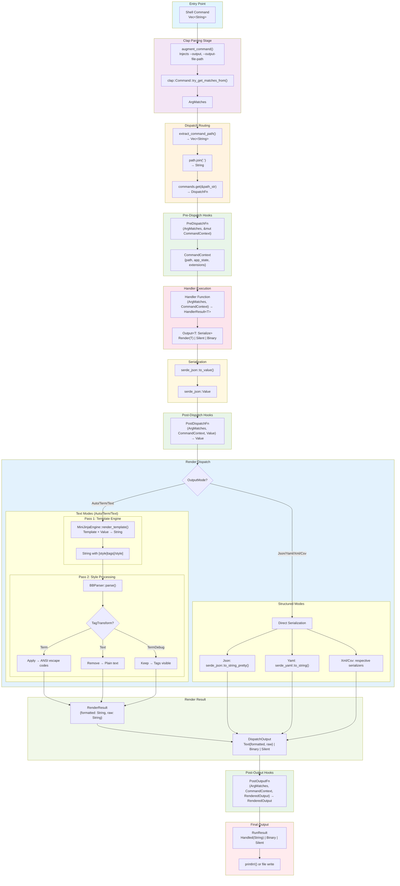

# Standout Command Flow Diagram

This diagram illustrates how a shell command input string is transformed through the standout framework.

## Type Flow Summary

| Stage | Input Type | Output Type |
|-------|-----------|------------|
| Entry | `Vec<String>` (CLI args) | - |
| Parsing | `Vec<String>` + `clap::Command` | `ArgMatches` |
| Routing | `ArgMatches` | `DispatchFn` lookup |
| Pre-Hooks | `(&ArgMatches, &mut CommandContext)` | Modified `CommandContext` |
| Handler | `(&ArgMatches, &CommandContext)` | `Result<Output<T>, Error>` |
| Serialization | `Output<T>` | `serde_json::Value` |
| Post-Hooks | `Value` | Transformed `Value` |
| Render (Structured) | `Value` + `OutputMode` | Formatted string (JSON/YAML/etc) |
| Render (Text Pass 1) | Template + `Value` | String with style tags |
| Render (Text Pass 2) | Tagged string + `TagTransform` | ANSI/plain/debug string |
| Result | `RenderResult` | `DispatchOutput` |
| Post-Output | `RenderedOutput` | Transformed `RenderedOutput` |
| Final | `RunResult` | Terminal output or file |

## Key Components

- **standout/cli/app.rs** - Entry point (`App::dispatch_from`)
- **standout/cli/core.rs** - Command augmentation
- **standout/cli/dispatch.rs** - Dispatch logic and render orchestration
- **standout-render/template/engine.rs** - MiniJinja template engine
- **standout-render/template/functions.rs** - `apply_style_tags()`, render functions
- **standout-bbparser** - Style tag to ANSI conversion
